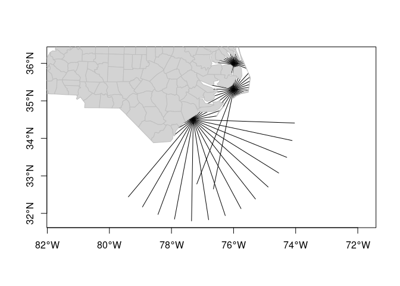
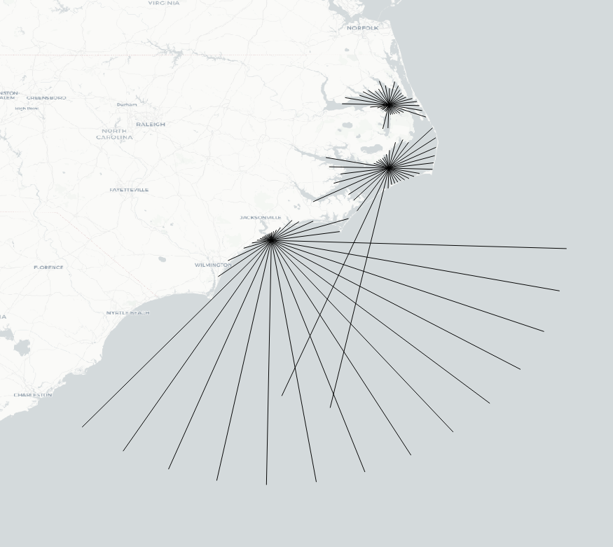

<!-- README.md is generated from README.Rmd. Please edit that file -->

# Wind fetch

Wind fetch is an important measurement in coastal applications. It
provides a measurement for the unobstructed length of water over which
wind from a certain direction can blow over. The higher the wind fetch
from a certain direction, the more energy is imparted onto the surface
of the water resulting in a larger sea state. Therefore, the larger the
fetch, the larger the exposure to wind and the more likely the site
experiences larger sea states.

# Why **windfetch**?

Averaging the wind fetch for numerous directions at the same location is
a reasonable measure of the overall wind exposure. The process of
manually calculating wind fetch can be extremely time-consuming and
tedious, particularly if a large number of fetch vectors are required at
many locations. The **windfetch** package calculates wind fetch for any
marine location on Earth. There are also plot methods to help visualise
the wind exposure at the various locations, and the ability to output
the fetch vectors to a shape file for further investigation.

# Installation

You can install and load the latest version of **windfetch** from
GitHub.

``` r
if (!require(remotes))
  install.packages("remotes")

# Install windfetch
remotes::install_github("blasee/windfetch")
```

``` r
# Load the windfetch and sf package
library(windfetch)
library(sf)
#> Linking to GEOS 3.9.0, GDAL 3.2.1, PROJ 7.2.1

# Read a shapefile of the North Carolina coastline
nc = st_read(system.file("shape/nc.shp", package = "sf"), quiet = TRUE)

# Create an sf geometry
ncg = st_geometry(nc)

# Project the coastline using the NAD83 projection
nc_proj = st_transform(ncg, "epsg:32119")

# Create a dataframe of the sites to calculate wind fetch at
sites_df = data.frame(lon = c(-76, -76, -77.3),
                      lat = c(36, 35.3, 34.5))

# Include spatial reference information by transforming to an sf object
sites_points = st_as_sf(sites_df, coords = c("lon", "lat"), crs = "epsg:4326")

# Project the points onto the same projection as the coastline
sites_points_proj = st_transform(sites_points, "epsg:32119")
```

# Calculating wind fetch with the **windfetch** package

If you already have an `sf` polygon object representing the coastline
and surrounding islands, and an `sf` points object representing the
locations, then calculating wind fetch with **windfetch** is easy. You
can just pass these two arguments into the `windfetch()` function.

``` r
plot(ncg, col = "lightgrey", border = "grey")
plot(sites_points, pch = "x", add = TRUE)
text(st_coordinates(sites_points), labels = paste("Site", 1:3), pos = 3)
```


``` r
# Calculate wind fetch by passing in the projected sf polygons object (nc_proj)
# and the projected points object (sites_points_proj) to the windfetch function.
my_fetch_proj = windfetch(nc_proj, sites_points_proj, progress_bar = FALSE)
#> checking site locations are not on land

summary(my_fetch_proj)
#> # A tibble: 12 x 3
#> # Groups:   site_name [3]
#>    site_name quadrant avg_fetch
#>    <chr>     <fct>          [m]
#>  1 Site 1    North        25128
#>  2 Site 1    East         24890
#>  3 Site 1    South        14726
#>  4 Site 1    West         26470
#>  5 Site 2    North        27791
#>  6 Site 2    East         39171
#>  7 Site 2    South        90781
#>  8 Site 2    West         51566
#>  9 Site 3    North        12844
#> 10 Site 3    East        192873
#> 11 Site 3    South       300000
#> 12 Site 3    West         24552
```

The `my_fetch_proj` object provides a summary of the fetch for all the
four quadrants, along with an average of the fetch length at all the
sites.

# Visualise the fetch vectors

## Projected space

``` r
# Plot the fetch vectors and the coastline in the projected space
plot(my_fetch_proj, axes = TRUE)
plot(nc_proj, col = "lightgrey", border = "grey", add = TRUE)
```

<!-- -->

## Unprojected latitude and longitude space

``` r
# Transform the CRS back to lats and longs
my_fetch_latlon = crs_transform(my_fetch_proj, "epsg:4326")

# Plot the fetch vectors and the coastline in lat lon space
plot(my_fetch_latlon, axes = TRUE)
plot(ncg, col = "lightgrey", border = "grey", add = TRUE)
```

<!-- -->

# Export to an ESRI shape file

``` r
# Transform the fetch object to an sf object
my_fetch_sf = as_sf(my_fetch_latlon)
my_fetch_sf
#> Simple feature collection with 108 features and 4 fields
#> Geometry type: LINESTRING
#> Dimension:     XY
#> Bounding box:  xmin: -79.39009 ymin: 31.79712 xmax: -74.03681 ymax: 36.30496
#> Geodetic CRS:  WGS 84
#> First 10 features:
#>    site_name directions quadrant        fetch                       geometry
#> 1     Site 1          0    North 19840.17 [m] LINESTRING (-76 36, -75.993...
#> 2     Site 1         10    North 28585.04 [m] LINESTRING (-76 36, -75.935...
#> 3     Site 1         20    North 24826.65 [m] LINESTRING (-76 36, -75.897...
#> 4     Site 1         30    North 20914.99 [m] LINESTRING (-76 36, -75.877...
#> 5     Site 1         40    North 18555.24 [m] LINESTRING (-76 36, -75.862...
#> 6     Site 1         50     East 17860.90 [m] LINESTRING (-76 36, -75.844...
#> 7     Site 1         60     East 19110.89 [m] LINESTRING (-76 36, -75.813...
#> 8     Site 1         70     East 24209.81 [m] LINESTRING (-76 36, -75.744...
#> 9     Site 1         80     East 27884.69 [m] LINESTRING (-76 36, -75.693...
#> 10    Site 1         90     East 30045.36 [m] LINESTRING (-76 36, -75.666...
```

``` r
# Export the fetch vectors to an ESRI shape file for further investigation
st_write(nc_fetch_sf, "nc_fetch.shp", driver = "ESRI Shapefile")
```



# Get started with **windfetch**

Read the short introductory vignette to get you started with
**windfetch**, and have a look at the simple, reproducible example in
the `windfetch()` function.

``` r
# A simple reproducible example
example(windfetch)
```

# Citation

Please refer to the [Data Access Portal entry at
CSIRO](http://hdl.handle.net/102.100.100/421787?index=1) for the
citation.
